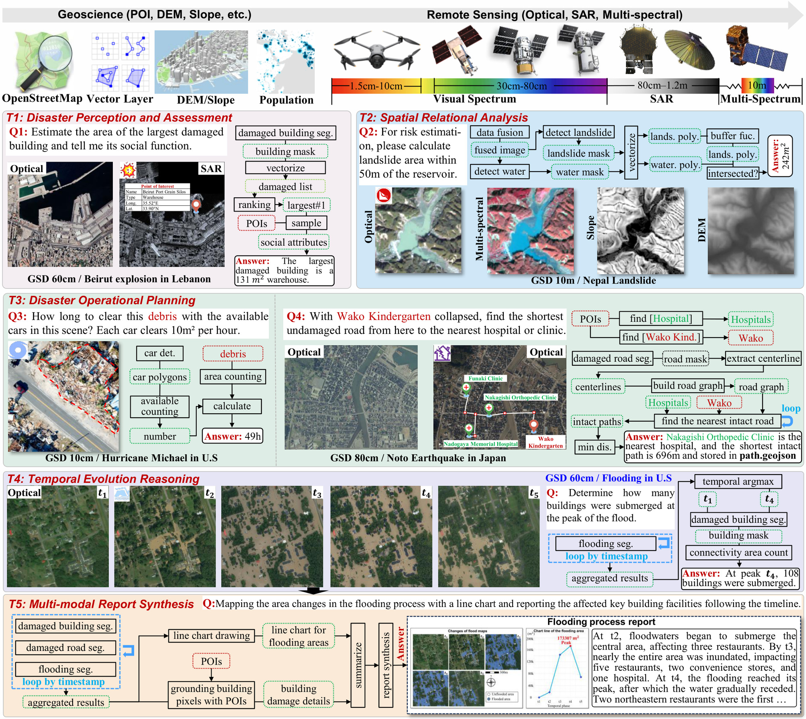
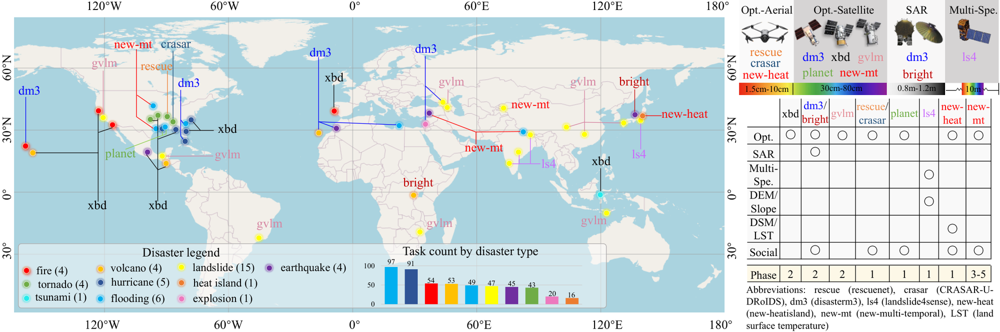
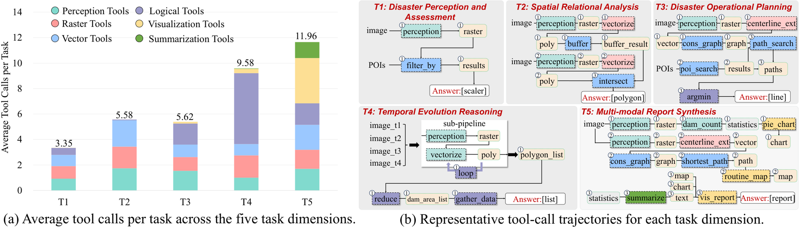
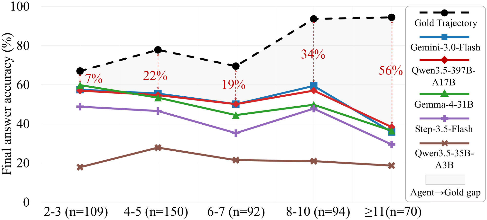

<h2 align="center">
  
  DORA: Can LLM Agents Respond to Disasters? Benchmarking Heterogeneous Geospatial Reasoning in Emergency Operations
</h2>

<h5 align="center"><a href="https://junjuewang.top/">Junjue Wang*</a>,
<a href="https://weihaoxuan.com">Weihao Xuan*</a>,
Heli Qi, Pengyu Dai, Kunyi Liu, <a href="https://chrx97.com/">Hongruixuan Chen</a>,
<a href="https://zhuozheng.top/">Zhuo Zheng</a></h5>
<h5 align="center">
Junshi Xia, <a href="https://cs.stanford.edu/~ermon/">Stefano Ermon</a>, <a href="https://naotoyokoya.com/">Naoto Yokoya†</a></h5>

<h5 align="center">
* Equal Contributions
† Corresponding Author</h5>

[[`Paper`](https://arxiv.org/abs/2605.11633)],
[`Dataset` (coming soon)]


<div align="center">
  
</div>

## Highlights
DORA (**D**isaster **O**perational **R**esponse **A**gent benchmark) includes 515 expert-authored tasks across 45 real-world disaster events of 10 types on 5 continents, paired with expert-verified, replayable gold trajectories totaling 3,500 tool-call steps, with three characteristics:
1. Operational: 5 analytical dimensions that follow the disaster-response pipeline, i.e., disaster perception and assessment, spatial relational analysis, disaster operational planning, temporal evolution reasoning, and multi-modal report synthesis, each grounded in UNOSAT, Copernicus EMS, FEMA and UN OCHA protocols
2. Heterogeneous: optical, SAR and multi-spectral imagery across single-, bi- and multi-temporal sequences (0.015–10 m GSD), complemented by DEM, slope, land surface temperature and social vector layers (POIs, road networks, population, facility footprints)
3. Agentic: agents compose calls from a 108-tool MCP library (perception, raster, vector, logical, visualization, summarization), and are evaluated on both tool-call trajectories and final answers

<div align="center">
  
</div>


## News
- 2026/09/25, We are preparing the dataset, tools and evaluation code.
- 2026/09/25, Our paper got accepted by NeurIPS 2026 (Evaluations & Datasets Track) as an **oral** presentation.
- 2026/05/12, Our paper is available on [arXiv](https://arxiv.org/abs/2605.11633).


## Benchmark

### Task taxonomy
| Dimension | #Tasks | Avg. steps | Operational protocol |
|:--|:--:|:--:|:--|
| T1: Disaster Perception & Assessment (PA) | 132 | 3.35 | UNOSAT Rapid Mapping, Copernicus EMS |
| T2: Spatial Relational Analysis (SR) | 108 | 5.58 | FEMA Hazus |
| T3: Disaster Operational Planning (OP) | 100 | 5.62 | FEMA Urban Search and Rescue (US&R) |
| T4: Temporal Evolution Reasoning (TE) | 61 | 9.58 | Copernicus EMS Monitoring |
| T5: Multi-modal Report Synthesis (RS) | 114 | 11.96 | UN OCHA Situation Reports, IFRC |

<div align="center">
  
</div>

### Tool library
All tools are implemented as MCP servers with a uniform JSON-RPC interface and typed input/output schemas, so any MCP-compatible agent framework can be evaluated without modification.

| Category | #Tools | Representative tools |
|:--|:--:|:--|
| Perception | 31 | `seg.building_damage`, `seg.flood`, `seg.road_damage` |
| Raster | 18 | `ras.area`, `ras.diff`, `ras.vectorize` |
| Vector | 31 | `vec.intersect`, `vec.shortest_path`, `poi.filter_by_damage` |
| Logical | 15 | `logi.loop`, `logi.reduce` |
| Visualization | 11 | `vis.damage_map`, `vis.route_map`, `vis.report_page` |
| Summarization | 2 | `m.extract_evidence`, `m.summarize` |

### Leaderboard
Final-answer accuracy (%) of 13 LLM agents under a ReAct-style loop. The best agent result in each column is in **bold**.

| Model | Type | AVG | T1 (PA) | T2 (SR) | T3 (OP) | T4 (TE) | T5 (RS) |
|:--|:--|:--:|:--:|:--:|:--:|:--:|:--:|
| Gold Trajectory | Oracle | 80.48 | 71.31 | 63.19 | 83.63 | 90.77 | 93.50 |
| Gemini-3.0-Flash | Commercial | **53.74** | 54.19 | 49.00 | **59.82** | 60.40 | 45.31 |
| Qwen3.5-397B-A17B | Open-source | 53.45 | 51.03 | **53.40** | 51.82 | 61.83 | **49.17** |
| MiMo-V2-Pro | Open-source | 52.89 | 53.68 | 47.43 | 55.48 | **63.58** | 44.26 |
| Grok-4.1-Fast | Commercial | 52.10 | 53.07 | **53.40** | 54.23 | 55.28 | 44.52 |
| Claude-Sonnet-4.6 | Commercial | 52.01 | **54.43** | 48.23 | 51.82 | 60.05 | 45.53 |
| Gemma-4-31B | Open-source | 51.17 | 51.46 | 49.00 | 52.33 | 61.03 | 42.03 |
| MiniMax-M2.7 | Open-source | 48.35 | 51.87 | 48.53 | 50.16 | 50.59 | 40.62 |
| DeepSeek-V3.2 | Open-source | 48.23 | 49.80 | 49.15 | 50.57 | 50.62 | 41.01 |
| GPT-5.4 | Commercial | 47.63 | 52.85 | 50.80 | 53.50 | 51.90 | 29.11 |
| Step-3.5-Flash | Open-source | 46.68 | 49.70 | 44.91 | 48.33 | 48.90 | 41.58 |
| GPT-5.4-Nano | Commercial | 38.14 | 44.40 | 33.41 | 39.98 | 45.55 | 27.37 |
| GPT-OSS-120B | Open-source | 35.11 | 42.70 | 37.58 | 42.00 | 24.43 | 28.84 |
| Qwen3.5-35B-A3B | Open-source | 24.01 | 14.15 | 13.89 | 33.08 | 37.62 | 21.30 |
| Gemini-3.0-Flash (w/o tools) | VLM | 18.55 | 5.98 | 19.91 | 17.48 | 29.36 | 20.03 |
| Qwen3-VL-235B (w/o tools) | VLM | 18.30 | 5.53 | 28.63 | 12.63 | 27.75 | 16.95 |

Gold Trajectory executes the expert-authored tool sequence with model-backed perception tools (not ground-truth masks), so it is a planning-and-argument oracle rather than a perfect-answer oracle. Trajectory metrics (Tool-Any-Order, Tool-In-Order, Tool-Exact-Match, Parameter Accuracy) and efficiency are reported in the paper.

Three persistent challenges:
1. Disaster-domain grounding exposes unique failure modes: damage-semantic grounding, sensor-modality mismatch and disaster-pipeline composition
2. Agents are doubly bottlenecked by tool selection and argument grounding: gold tool-order hints improve accuracy by only 1.08–4.40%, and alternative scaffolds yield at most a 3.24% gain
3. Compositional fragility scales with trajectory length: the agent-to-gold gap widens from 7% to 56% on long pipelines

<div align="center">
  
</div>

### Data format
Each task is a tuple of a query (Q), a heterogeneous data manifest (D), a gold tool-call trajectory (T) and a structured final answer (A), stored as a JSON meta file. A simplified example:
```text
{
  sample_id: "beirut_explosion1",
  question: "How many intact hospitals situated within 800 m of the Beirut Port Grain Silos explosion site's center.",
  input_data: {
    pre_image:  {image_path: "pre_disaster1.tif",  modality: "optical", GSD_m: 0.8, coordinate_system: "WGS84", band: ["R", "G", "B"]},
    post_image: {image_path: "post_disaster1.tif", modality: "SAR",     GSD_m: 0.8, coordinate_system: "WGS84", band: "intensity"},
    poi_data:   {path: "poi.geojson"},
    ...
  },
  trajectory: [
    {call: "poi.search_by_name",
     args: {geojson_path: "poi.geojson", name: "Beirut Port Grain Silos"},
     obs:  {latitude: 33.9009381, longitude: 35.5182691, type: "establishment", ...}},
    ...
  ],
  answer: 5
}
```

### Evaluation
The benchmark and evaluation code will be released here. Stay tuned!
- [ ] 515 task packages (queries, data manifests, gold trajectories and final answers)
- [ ] Instructions for downloading the source imagery and vector data from the original providers
- [ ] 108-tool MCP library and perception backbone checkpoints
- [ ] Evaluation scripts for trajectory and final-answer metrics


## Citation
If you use DORA in your research, please cite our following papers.
```text
@inproceedings{wang2026dora,
  title={Can LLM Agents Respond to Disasters? Benchmarking Heterogeneous Geospatial Reasoning in Emergency Operations},
  author={Wang, Junjue and Xuan, Weihao and Qi, Heli and Dai, Pengyu and Liu, Kunyi and Chen, Hongruixuan and Zheng, Zhuo and Xia, Junshi and Ermon, Stefano and Yokoya, Naoto},
  booktitle={Proceedings of the Neural Information Processing Systems},
  year={2026}
}

@inproceedings{wang2025disasterm3,
  title={DisasterM3: A Remote Sensing Vision-Language Dataset for Disaster Damage Assessment and Response},
  author={Wang, Junjue and Xuan, Weihao and Qi, Heli and Liu, Zhihao and Liu, Kunyi and Wu, Yuhan and Chen, Hongruixuan and Song, Jian and Xia, Junshi and Zheng, Zhuo and Yokoya, Naoto},
  booktitle={Proceedings of the Neural Information Processing Systems},
  year={2025}
}
```


## License
All tasks, gold trajectories and annotations in DORA can be used for academic purposes only,
<font color="red"><b> but any commercial use is prohibited.</b></font>

Source imagery and vector data are not redistributed in this repository. Please obtain them from the original providers and follow their licenses; the data sources are listed in the paper.

<a rel="license" href="https://creativecommons.org/licenses/by-nc-sa/4.0/deed.en">
</a>

## Star History

<a href="https://www.star-history.com/#Junjue-Wang/DORA&Date">
 <picture>
   <source media="(prefers-color-scheme: dark)" srcset="https://api.star-history.com/svg?repos=Junjue-Wang/DORA&type=Date&theme=dark" />
   <source media="(prefers-color-scheme: light)" srcset="https://api.star-history.com/svg?repos=Junjue-Wang/DORA&type=Date" />
   
 </picture>
</a>
